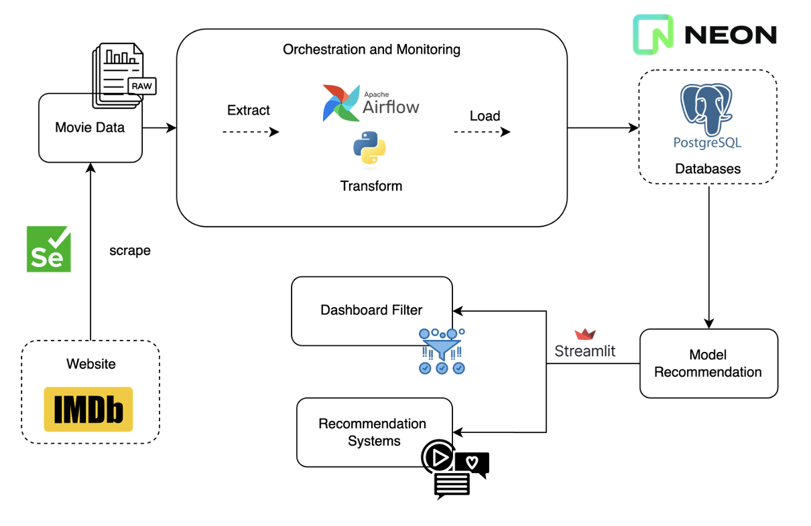

# Movie Recommendation System

This repository contains the code and resources for a movie recommendation system. It includes data samples, scripts for data processing and analysis, and visualization tools.

## Structure

- **data_sample**: Contains sample data used in the recommendation system.
  - `movie_merged_output.csv`: Merged data output file.

- **demo_streamlit**: Streamlit applications for interactive dashboard visualizations.
  - `dashboard_filter.py`: Code for filtering options in the dashboard.
  - `dashboard_options.py`: Code handling different options available in the dashboard.
  - `dashboard_visual.py`: Visualization aspects of the dashboard.
  - `recommendation_model.py`: Core recommendation model script.

- **ETL**: Scripts for Extract, Transform, Load processes.
  - `crawler.py`: Script for crawling data.
  - `create_postgre_neon.py`: Script to set up PostgreSQL databases.
  - `etl_movies_pipeline.py`: ETL pipeline script for processing movie data.

- **images_sample**: Sample images used within the system.
  - `dags.png`: Image depicting the Directed Acyclic Graph for processes.
  - `pipeline.png`: Overview image of the recommendation system pipeline.

## Installation

To set up this project, you need to install the required Python packages:

```bash
pip install -r requirements.txt

